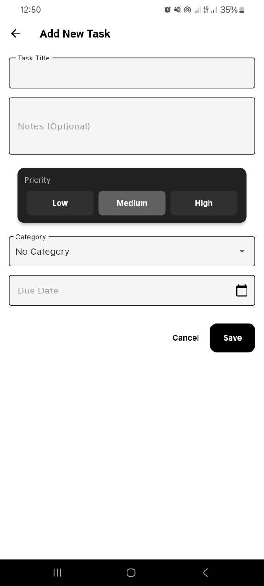
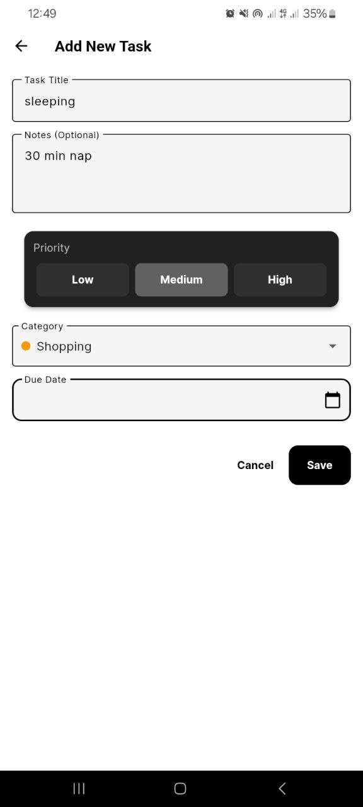
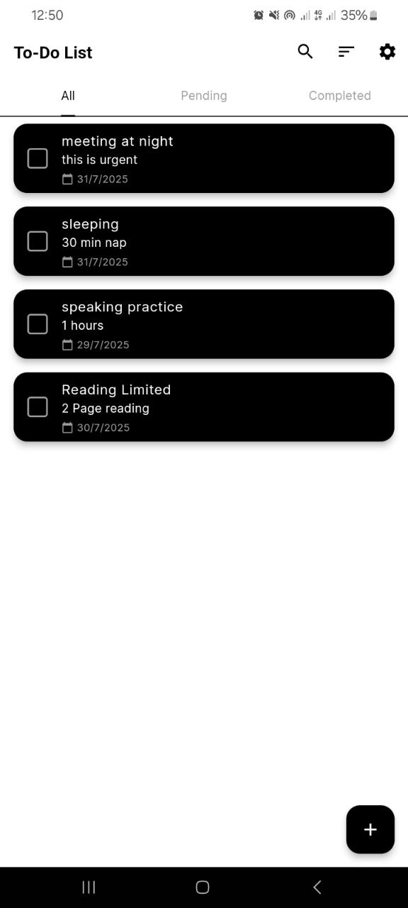
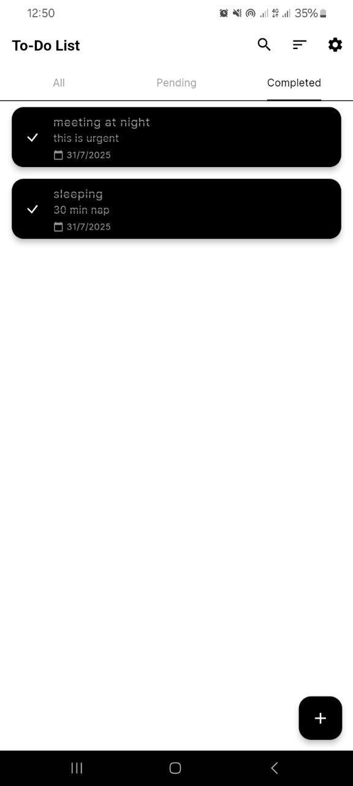
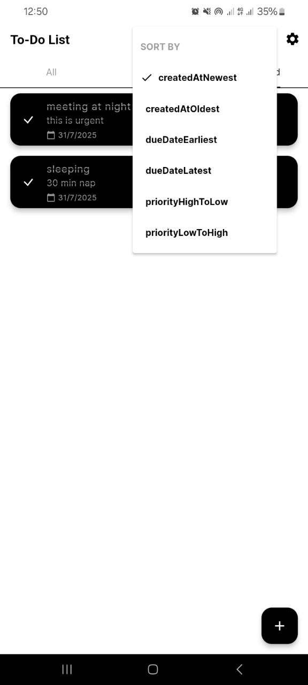
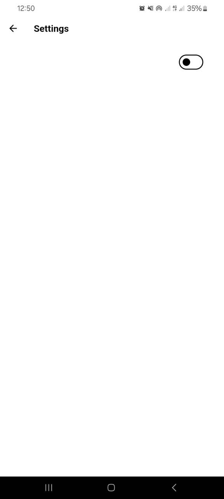

# To-Do List App

A sleek and modern to-do list application built with Flutter. This app helps you organize your tasks efficiently with a clean, dark-themed interface, smooth animations, and persistent local storage.

## ✨ Features

- **Create, Edit, & Delete Tasks:** Easily manage your to-do list with intuitive controls.
- **Task Priorities:** Assign priorities (Low, Medium, High) to stay focused on what matters most.
- **Categorization:** Organize tasks into custom categories.
- **Due Dates:** Set deadlines to keep track of your schedule.
- **Mark as Complete:** Simple swipe or tap gesture to mark tasks as done.
- **Persistent Storage:** Your tasks are saved locally on your device using Hive, so you never lose your data.
- **Dark Theme:** A beautiful, consistent dark mode across the entire app for a great user experience.
- **Smooth Animations:** Enjoy a polished feel with fluid animations and transitions.
- **Filtering & Sorting:** Quickly find tasks by filtering and sorting them based on different criteria.

## 🛠️ Tech Stack

- **Framework:** [Flutter](https://flutter.dev/)
- **Language:** [Dart](https://dart.dev/)
- **State Management:** [GetX](https://pub.dev/packages/get)
- **Local Storage:** [Hive](https://pub.dev/packages/hive)

## 🚀 Getting Started

Follow these instructions to get a copy of the project up and running on your local machine for development and testing.

### Prerequisites

Make sure you have the Flutter SDK installed on your machine. For instructions, see the [official Flutter documentation](https://flutter.dev/docs/get-started/install).

### Installation

1. **Clone the repository:**
   ```sh
   git clone https://github.com/your-username/todo_list.git
   ```

2. **Navigate to the project directory:**
   ```sh
   cd todo_list
   ```

3. **Install dependencies:**
   ```sh
   flutter pub get
   ```

4. **Run the app:**
   ```sh
   flutter run
   ```

## 📸 Screenshots

<p float="left">
  
   
   
   
   
  


</p>


| Splash Screen | Task List | Add/Edit Task |
| :---: | :---: | :---: |
|  |  |  |

## 🤝 Contributing

Contributions, issues, and feature requests are welcome! Feel free to check the [issues page](https://github.com/your-username/todo_list/issues).


A new Flutter project.

## Getting Started

This project is a starting point for a Flutter application.

A few resources to get you started if this is your first Flutter project:

- [Lab: Write your first Flutter app](https://docs.flutter.dev/get-started/codelab)
- [Cookbook: Useful Flutter samples](https://docs.flutter.dev/cookbook)

For help getting started with Flutter development, view the
[online documentation](https://docs.flutter.dev/), which offers tutorials,
samples, guidance on mobile development, and a full API reference.
